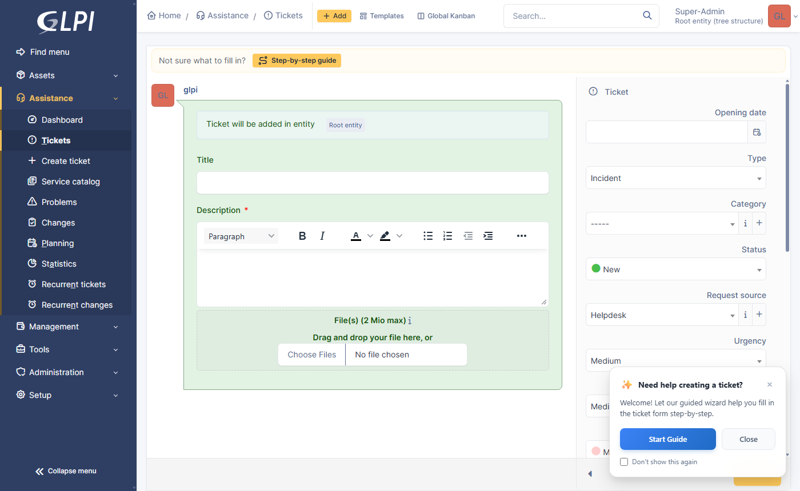
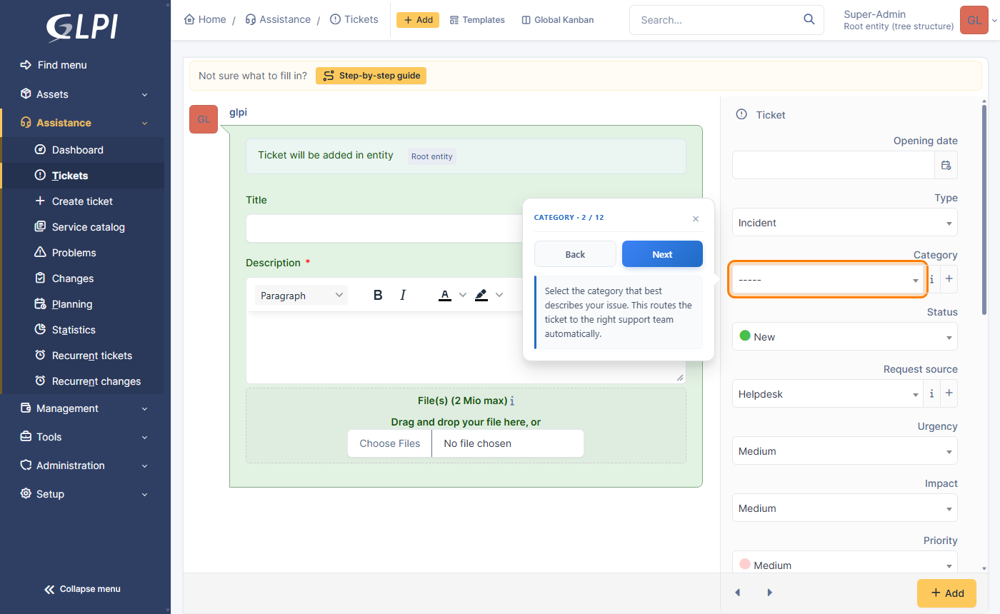
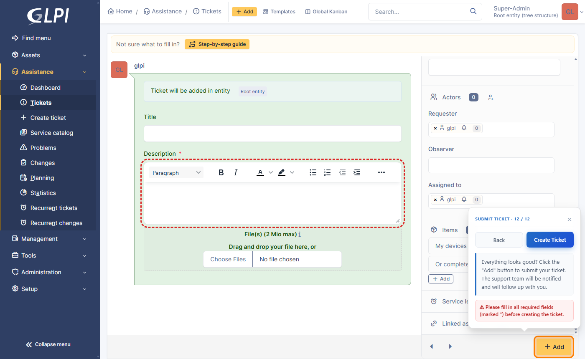
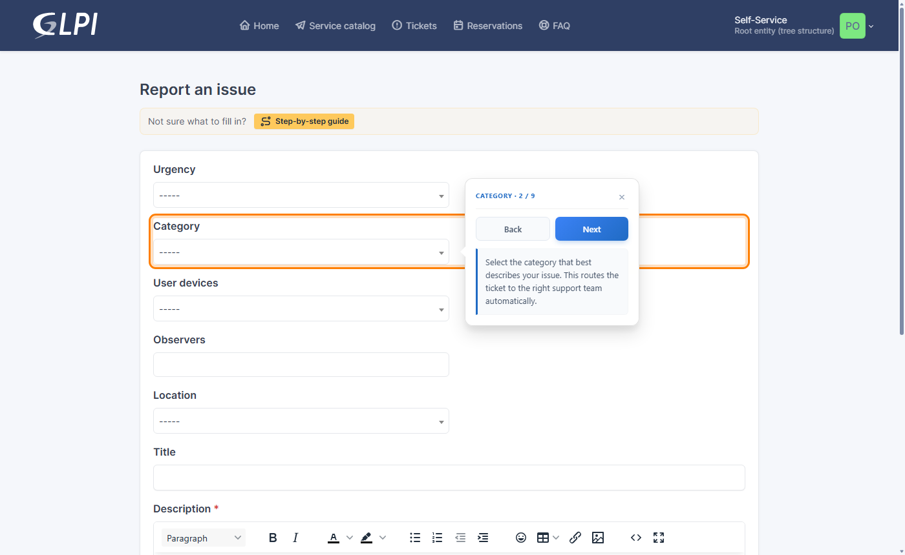
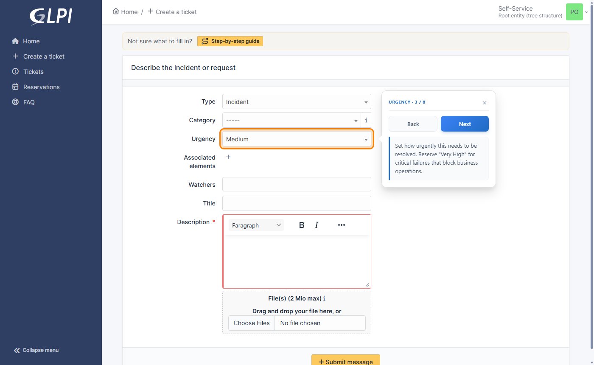
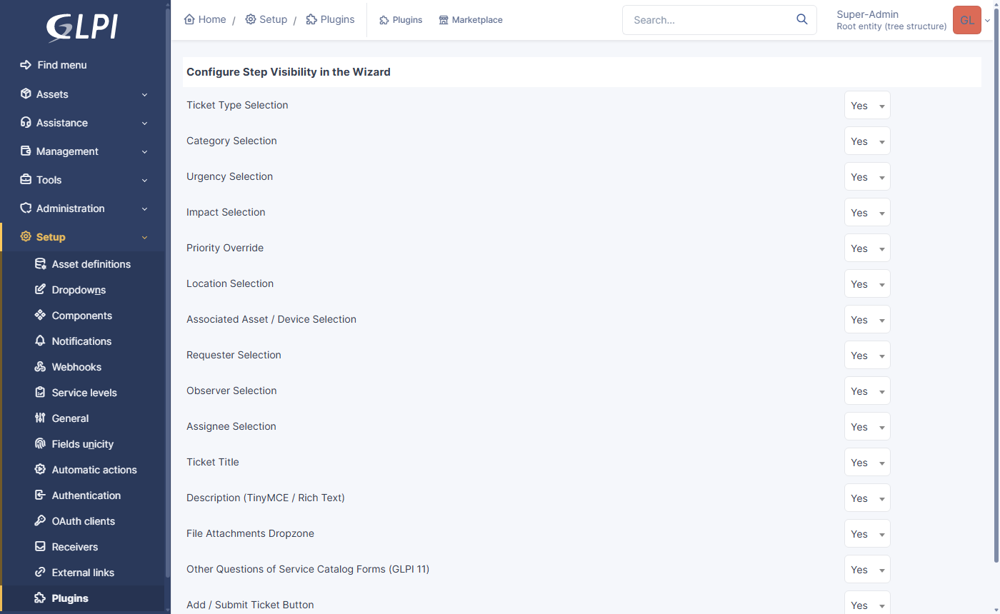

# Ticket Guided Wizard — GLPI Plugin

> A step-by-step guided wizard that helps end-users create GLPI tickets correctly, in both the **Standard** and **Simplified** interfaces — including GLPI 11's **service catalog** forms.

**Version:** 1.0.0  
**License:** MIT  
**GLPI Compatibility:** 10.0 and 11.0 (tested on 10.0.28 and 11.0.11)

---

## 📸 Screenshots

**Ticket form:** the "Step-by-step guide" bar at the top of the form, and the welcome popup.



**A guide step:** the field is highlighted, with what to fill in next to it.



**Required fields:** on the last step, empty required fields are ringed in red and the ticket isn't created until they're filled.



**GLPI 11 simplified interface:** the guide on a service catalog form.



**GLPI 10 simplified interface:** the guide on the ticket form.



**Settings:** choose which steps the guide shows, in **Setup → Plugins → Ticket Guided Wizard**.



---

## ✨ Features

| Feature | Details |
|---|---|
| Step-by-step wizard | Guides users through every ticket field one at a time |
| Both interfaces | Standard interface ticket form; Simplified interface ticket form (GLPI 10) or service catalog forms (GLPI 11) |
| Service catalog forms | One step per question, with the matching advice for urgency, category, devices, title, description… Multi-page forms and questions shown by conditions are followed |
| Back / Next navigation | Full forward and backward navigation between steps |
| Instructions below buttons | Instructions never overlap form fields or dropdowns |
| Non-blocking UI | Wizard popup floats beside the highlighted field when there is room, and hides while a dropdown is open |
| Required fields | Empty required fields turn red; the wizard won't create the ticket until they're filled |
| Welcome popup | Slide-in notification on page load; users can dismiss it, or tick **Don't show this again** |
| Guide bar | A "Step-by-step guide" button at the top of the ticket form starts the wizard at any time |
| Resumes after reload | GLPI reloads the ticket form when Type or Category changes: the wizard continues on the same step |
| Admin settings | Choose which steps to show in **Setup → Plugins → Ticket Guided Wizard** |
| SPA-aware | Detects URL changes from GLPI's pushState router and re-initialises |
| Multi-language | English, Japanese, Korean, Vietnamese, Brazilian Portuguese, Italian |

---

## 📋 Requirements

- **GLPI** 10.0 or 11.0
- **PHP** ≥ 8.1 (GLPI 11 itself needs 8.2)
- A modern browser (Chrome 90+, Firefox 88+, Edge 90+, Safari 14+)

---

## 📂 Directory Structure

```
plugins/ticketwizard/
├── setup.php          ← Plugin metadata, hooks, init function, step list
├── hook.php           ← Install / Uninstall callbacks
├── compile.php        ← CLI utility: compiles .po files → binary .mo files
├── LICENSE            ← MIT license
├── README.md          ← This file
├── ajax/
│   └── config.php     ← JSON settings for the wizard (and service catalog question types)
├── front/
│   └── config.php     ← Settings page (Setup → Plugins)
├── inc/
│   └── formsteps.php  ← GLPI 11: matches service catalog questions to wizard steps
├── public/
│   ├── css/
│   │   └── wizard.css ← All plugin styles (glassmorphism, animations)
│   └── js/
│       └── wizard.js  ← Wizard engine (field detection, positioning, i18n)
└── locales/
    ├── en_US.po       ← English source strings (each .po has its compiled .mo)
    ├── ja_JP.po       ← Japanese
    ├── ko_KR.po       ← Korean
    ├── vi_VN.po       ← Vietnamese
    ├── pt_BR.po       ← Brazilian Portuguese
    └── it_IT.po       ← Italian
```

GLPI 11 only serves a plugin's web files from its `public/` folder; GLPI 10 serves them from there too, through the paths set in `setup.php`.

---

## 🚀 Installation

### 1. Copy the plugin folder

Place the `ticketwizard` folder inside your GLPI `plugins/` directory:

```
your-glpi-root/
└── plugins/
    └── ticketwizard/   ← drop the whole folder here
```

### 2. (Optional) Compile locale files

The wizard ships with all translations embedded in `public/js/wizard.js` and does **not** require compiled `.mo` files for its wizard UI. The `.po`/`.mo` files are only used for the GLPI administration panel labels (the settings page).

The compiled `.mo` files are included, so this step is only needed after you edit a `.po` file. To compile them, run from a terminal inside the plugin folder:

```bash
php compile.php
```

This creates a `.mo` binary next to each `.po` file. You need PHP ≥ 8.1 — no external `msgfmt` tool is required.

### 3. Activate in GLPI

1. Log in as a GLPI administrator.
2. Go to **Setup → Plugins**.
3. Find **Ticket Guided Wizard** and click **Install**, then **Activate**.

### Upgrading

Replace the `ticketwizard` folder with the new one. GLPI then shows the plugin as **To update**: click **Upgrade**, then **Activate** again. Your step settings are kept. This also works from the earlier 1.0.6 build: GLPI offers the upgrade whenever the version changes, even to a lower number.

---

## 🎯 How It Works

Once activated, the plugin automatically injects `wizard.css` and `wizard.js` into every GLPI page for logged-in users. The wizard starts on these pages:

| Interface | GLPI 10 | GLPI 11 |
|---|---|---|
| Standard | Ticket form (`front/ticket.form.php`) | Ticket form (`front/ticket.form.php`) |
| Simplified | Ticket form (**Create a ticket**, `front/helpdesk.public.php?create_ticket=1`) | Service catalog forms (**Create a ticket → Service catalog**, `/Form/Render/<id>`), such as *Report an issue* and *Request a service* |

GLPI 11's simplified interface no longer has a ticket form: users pick a form in the service catalog, and the form creates the ticket. Service catalog users in the standard interface get the wizard on these forms too.

### On a ticket form

1. A **welcome popup** slides in from the bottom-right corner.
2. The user can click **Start Guide** to begin, or **Close** to dismiss. Ticking **Don't show this again** first stops the popup from appearing in that browser; the **Step-by-step guide** button at the top of the form still starts the guide.
3. The wizard scans the page for visible ticket fields and builds a step list dynamically (steps vary between Standard and Simplified interfaces).
4. Each step highlights the relevant field with a pulsing orange glow (red while a required field is still empty) and shows a floating popup with:
   - A step indicator (e.g., *Category · 2 / 9*)
   - **Back** and **Next** buttons
   - A plain-language instruction below the buttons
5. The popup is positioned automatically to avoid covering the highlighted field: beside dropdowns, below or above other fields.
6. The last step points at the submit button. Its **Create Ticket** button submits the ticket — unless a required field is empty: the wizard then rings it in red and warns instead.

### On a service catalog form (GLPI 11)

The steps are the form's questions, in order, with the question's own label as the step title. When a question fills a ticket field — urgency, category, location, devices, requester, observers, assignees, title, description, attachments — the wizard gives the same advice as on the ticket form. Other questions show their description, or a general instruction.

- **Multi-page forms:** the last step of each page points at **Continue**, and the wizard carries on with the next page.
- **Conditions:** questions that appear or disappear as the user answers are added to or removed from the steps.
- **Submitting:** **Create Ticket** sends the form with GLPI's **Submit** button. GLPI also checks the answers itself and shows any error under the question.

### When the guide resumes or restarts

The guide remembers its step in the browser tab. It:
- **resumes on the same step** when GLPI reloads the ticket form, for example after the user changes the Type or Category;
- **restarts with the welcome popup** after the ticket is created, after the user closes the guide, or after following a link to another page.

---

## ⚙️ Settings

**Setup → Plugins → Ticket Guided Wizard** (the plugin's name or its settings icon) lists the steps with a Yes/No choice each. Steps set to **No** are skipped:

- **Required fields are never skipped**, so users always see what they must fill in.
- **Other Questions of Service Catalog Forms (GLPI 11)** covers the service catalog questions that don't fill a ticket field (radio buttons, dates, free text…).
- **Add / Submit Ticket Button:** when set to No, the guide ends on the last field with a **Finish** button that just closes it; users then submit as usual.

---

## 🌐 Supported Languages

The wizard detects the active language from the `<html lang="...">` attribute set by GLPI and automatically uses the matching translation. Falls back to English if the language is not supported.

| Code | Language |
|---|---|
| `en` | English (default) |
| `ja` | Japanese / 日本語 |
| `ko` | Korean / 한국어 |
| `vi` | Vietnamese / Tiếng Việt |
| `pt` | Brazilian Portuguese / Português do Brasil |
| `it` | Italian / Italiano |

Button names in the instructions (e.g. *Click the "Add" button*) are read from the page, so they always match the label GLPI shows in the user's language.

---

## 🔧 Customisation

All wizard text is defined in the `TRANSLATIONS` object at the top of [`public/js/wizard.js`](public/js/wizard.js). To add a new language:

1. Add a new locale key (e.g., `fr`) with all the required string keys.
2. Create a corresponding `.po` file in `locales/` and run `php compile.php`.

The step list is built dynamically by `buildTicketSteps()` (ticket forms) and `buildCatalogSteps()` (service catalog forms) in `wizard.js`. Fields are only added as steps if they are **visible** in the current interface — so the wizard adapts automatically between the Standard and Simplified interfaces without any configuration.

---

## 🐛 Known Limitations

- On ticket forms, the wizard only activates on pages with a `[name="add"]` submit button (GLPI's ticket creation form marker).
- On service catalog forms, the advice matches a question to a ticket field by its type. A short-text question counts as the ticket title only if the form's ticket destination uses its answer as the title; a long-text question counts as the description if it's the form's only one, or the destination uses it for the description.
- The floating popup uses `position: fixed`, so it stays on screen even when scrolling — by design.

---

## 📄 License

```
MIT License

Copyright (c) 2026 Ticket Guided Wizard contributors

Permission is hereby granted, free of charge, to any person obtaining a copy
of this software and associated documentation files (the "Software"), to deal
in the Software without restriction, including without limitation the rights
to use, copy, modify, merge, publish, distribute, sublicense, and/or sell
copies of the Software, and to permit persons to whom the Software is
furnished to do so, subject to the following conditions:

The above copyright notice and this permission notice shall be included in all
copies or substantial portions of the Software.

THE SOFTWARE IS PROVIDED "AS IS", WITHOUT WARRANTY OF ANY KIND, EXPRESS OR
IMPLIED, INCLUDING BUT NOT LIMITED TO THE WARRANTIES OF MERCHANTABILITY,
FITNESS FOR A PARTICULAR PURPOSE AND NONINFRINGEMENT. IN NO EVENT SHALL THE
AUTHORS OR COPYRIGHT HOLDERS BE LIABLE FOR ANY CLAIM, DAMAGES OR OTHER
LIABILITY, WHETHER IN AN ACTION OF CONTRACT, TORT OR OTHERWISE, ARISING FROM,
OUT OF OR IN CONNECTION WITH THE SOFTWARE OR THE USE OR OTHER DEALINGS IN THE
SOFTWARE.
```
